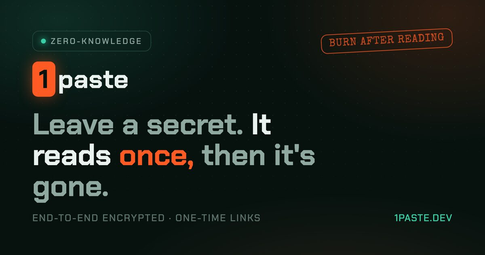

# 1paste

[](https://github.com/r87-e/1paste.dev/actions/workflows/ci.yml)
[](LICENSE)
[](https://1paste.dev)

Zero-knowledge, burn-after-read secret sharing.

Share a password, an API key, a private note, or a log with a link that
self-destructs. Everything is encrypted in your browser with AES-256-GCM before
it leaves your device, so the server only ever stores ciphertext it has no key
for. It reads once, then it is gone.

Think of it as a private alternative to a pastebin or a one-time secret service,
except the server never sees your data. Good for sending passwords, API keys,
recovery codes, and short-lived notes.

Live at [1paste.dev](https://1paste.dev). Built on Cloudflare Workers, MIT licensed.



## Why it is different

Most "secure" pastebins store your text in plaintext and promise not to look.
1paste cannot look, because there is nothing readable on the server.

- True end-to-end encryption. AES-256-GCM runs in the browser via WebCrypto.
  The server receives ciphertext and never receives the key.
- The key lives in the link. It rides in the URL fragment, after the `#`,
  which browsers never send to a server. Anyone with the link can decrypt. The
  host cannot.
- Burn after reading. A one-time paste is destroyed the instant it is first
  opened. The read and the delete happen atomically, so two people racing the
  same link cannot both win.
- Passphrase mode. Derive the key from a shared word with PBKDF2 instead of
  putting it in the link. Text someone the link and say the passphrase out loud.
- Self-destruct timer. Anywhere from 5 minutes to 7 days. Pastes are erased on
  expiry whether or not they were ever opened.
- Verifiable. It is open source, and you can inspect the exact ciphertext the
  server holds from inside the interface.

## How it works

```
browser                               cloudflare edge

  plaintext
    |  encrypt in-browser (AES-256-GCM)
    v
  ciphertext  ==POST==>   durable object, one per paste
                          holds { iv, ciphertext }, no key, no plaintext
                          atomic read-and-burn when opened

  the key stays in the URL #fragment, which never leaves the browser
```

1. You encrypt. The note is sealed with a random AES-256 key inside your browser.
2. The edge stores ciphertext. Only the encrypted blob arrives, with no key
   attached, and a one-time link comes back: `https://1paste.dev/s/<id>#<key>`.
3. The recipient reads it once. Opening the link fetches the ciphertext, decrypts
   it on their device, and a burn-after-read secret is shredded on the spot.

Link previews and crawlers cannot burn a paste, because the receive page is
non-destructive. Only pressing Reveal consumes it.

## Architecture

| Concern | Choice |
| --- | --- |
| Runtime | Cloudflare Workers |
| Routing and SSR | [Hono](https://hono.dev) with JSX |
| Storage | One SQLite-backed Durable Object per paste, for atomic burn and expiry alarms |
| Rate limiting | Workers KV counters, which never touch paste content |
| Crypto | WebCrypto AES-256-GCM, PBKDF2 for passphrase mode |
| Fonts and assets | Chakra Petch and Special Elite embedded as data URIs, OG image served by the Worker |
| Dependencies | One (`hono`) |

```
src/
  index.tsx        Hono app: routes, validation, rate limiting, SEO endpoints
  do/paste.ts      Durable Object: atomic read-and-burn, expiry alarm
  views/           SSR: layout (SEO head), home, receive page, styles, fonts
  client/          browser crypto: shared / compose / open
  lib/             types and collision-safe id generation
  assets/          embedded fonts and OG image
test/              workerd integration tests (burn, validation, crypto round-trip)
```

## Develop

```bash
npm install
npm run dev        # wrangler dev on http://localhost:8787
npm test           # integration tests in the real workerd runtime
npm run typecheck
```

## Deploy your own

```bash
# 1. create the rate-limit KV and paste the ids into wrangler.toml
wrangler kv namespace create RATE
wrangler kv namespace create RATE --preview

# 2. deploy (creates the SQLite Durable Object on first push)
wrangler deploy
```

To serve a custom domain, add the zone to the same Cloudflare account and
uncomment the `routes` in `wrangler.toml`. Current Cloudflare accounts require
SQLite-backed Durable Objects, so the migration uses `new_sqlite_classes`.

## Security model

- The server stores `{ iv, ciphertext, salt?, flags }` and nothing else. No key
  and no plaintext, ever.
- In random-key mode the AES key is generated on the client and placed in the URL
  fragment. It is never transmitted to or logged by the server.
- In passphrase mode the key is derived with PBKDF2 (SHA-256, 250k iterations)
  from a salt stored on the server plus a passphrase that never leaves the sender
  and recipient.
- Ciphertext is capped at 256 KB, and paste creation is rate limited per IP.
- Paste pages are served `noindex`. Only the homepage is indexable.

To report a vulnerability, see [SECURITY.md](SECURITY.md).

## License

MIT. Fonts: [Chakra Petch](https://fonts.google.com/specimen/Chakra+Petch) and
[Special Elite](https://fonts.google.com/specimen/Special+Elite), both under the
SIL Open Font License.
